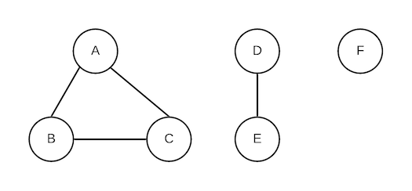
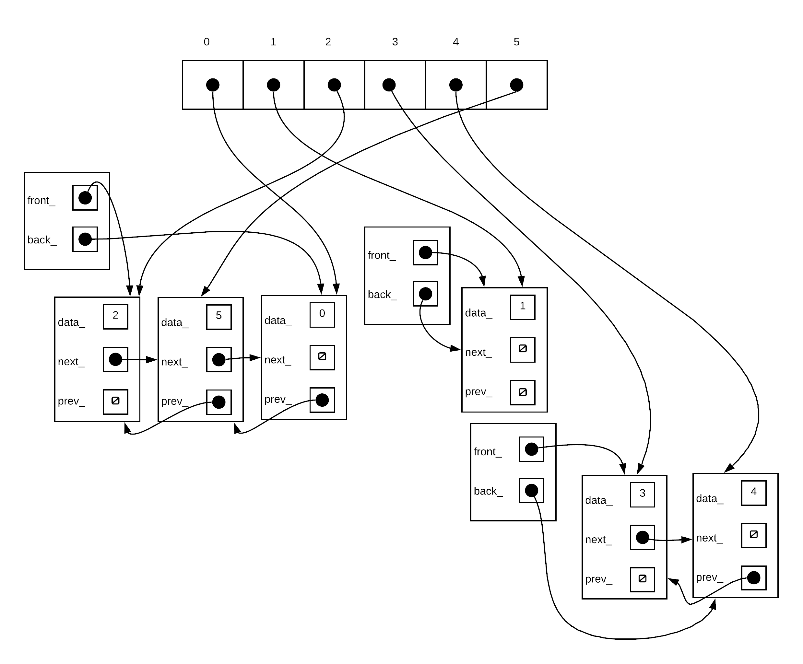

# Maze Runner

Implement an abstract data type (ADT) called a Disjoint Set using a linked list implementation. Disjoint Set is used to create a maze, using recursive function. No part of the Standard Library is used for this project.

## Disjoint Set

The disjoint set S is a set of non-empty sets = {S1, S2, S3...Sk} where no member of Si exist in any other set Sj,where i != j. That is, Si and Sj have no members in common. Each set has an unique identifying member called the representative. A disjoint set ADT has the following operations:

- makeSet(object):
  - creates a new set where object is the only member of the set. object is the representative of this new set as it is the only member. each object must be uniquely identifiable (ie no two objects in the disjoint set are the same)

- findSet(object):
  - returns the representative of the set containing object

- unionSets(object1, object2):
  - given two objects, unionSets combines the two sets into one set such that the new set contains every member of two original as long as object1 and object2 were in two separate sets at the start.

The disjoint set in an abstract data type which means that while the above 3 operations describe what it does, it does not speak to any particular implementation. For the purposes of this assignment, we will implement our disjoint set by using linked lists.

Disjoint sets can be useful for various algorithms. For example it can be used to find the connected components within a graph. Here is a graph with 3 different connected components.



to determine which vertices(the circles) are connected, we start by forming a disjoint set for every vertex:

{{A}, {B}, {C}, {D}, {E}, {F}}.

Then for each of the edges (the lines) we join the associated vertices together if not already joined. The edges are:

A-B
B-C
A-C
D-E
Basic algorithm

```c++
   for each vertex v{
      //create a separate set for each vertex
      makeSet(v);
   }
   for each edge e{
      let v1 and v2 represent vertices of edge e;
      rep1=findSet(v1);
      rep2=findSet(v2);
      if(rep1!=rep2){
         unionSets(rep1,rep2);
      }
   }
```

| edge     | rep1 | rep2 | disjoint set                    |
|----------|------|------|---------------------------------|
| Initial: |      |      | {{A}, {B}, {C}, {D}, {E}, {F}}  |
| A-B      | A    | B    | {{A,B},{C},{D},{E},{F}}         |
| B-C      | A    | C    | {{A,B,C}, {D},{E},{F}}          |
| A-C      | A    | C    | {{A,B,C}, {D},{E},{F}}          |
| D-E      | D    | E    | {{A,B,C}, {D,E},{F}}            |

And thus we end up with 3 sets, each set representing the vertices that are connected. In any case, this example is just here to illustrate what a disjoint set is and how it can be used to solve a problem.

### The DisjointSet Class
To simplify our implementation of the DisjointSets class, we will identify each object by a unique number starting from 0. There are better ways that you might have to implement a disjoint set for other types of identifiers but for our purposes a number is good enough. In other words, we view every member that can be in any disjoint set as single number, our objects will be just a number.

When a DisjointSets is instantiated, it is passed a number representing the maximum number of unique items in the disjoint set. Thus the objects for the disjoint set would be a number ranging from 0 to max-1. No object in the set will have a value outside this range.

Each of the sets within the disjoint sets are represented by a separate linked list. Each node within the linked lists contain a member of the disjoint set.

Our disjoint set will be made of an array of Node*. When a set is first created using makeSet(), we instantiate a node and form a linked list with just that node. The unionSets() function thus combines two existing linked list into one.

Example:
Suppose you had the following disjoint set: { {0,2,5},{1},{3,4}}

Our representation would create a structure similar to the following: **Note this diagram is just a very rough guide. You are allowed to change the exact nature of the list. The list can be singly linked or circular for example. You are also allowed to add extra information to each node in order to improve performance. You are even allowed to make the linked list without the "List" header object (ie just nodes linked together, use nullptrs to indicate front/back). You are allowed to add other members to the disjointSet class to help support your processing also. This diagram is only a very rough guide. **



### Member functions
- bool makeSet(int object):

  - Creates a new set with object as the only member of the set
  - if object is out of range (not between 0 and max-1) or object is already part of a set, function does nothing and returns false
  - otherwise function creates a set with object as its only member and returns true
  - in other words this will form a linked list with one node who's value is object
  - this one value is also the representative of the set

- int findSet(int object) const: 

  - returns the representative of the set containing object
  - if object is not part of any set or is invalid, function returns -1
  - Note that any member can be chosen as the representative. However, once chosen, the representative cannot change unless the membership of the set is changed (for example when unionSets() is performed).

- bool unionSets(int object1, int object2):

  - this combines the two sets of object1 and object2
  - if either object1 or object2 are not in any set or is invalid, function does nothing and returns false
  - if object 1 and object 2 are in the same set, function does not nothing and returns true
  - if object 1 and object 2 are in different sets:
  - function combines the two sets (joins together the two linked lists)
  - A new representative is chosen. This new representative can be any member of the new set. That is a call to findSet() using any of the original members would result in the new representative.
  - function returns true

Aside from the above functions, you need to also implement the following:

```
copy constructor 
move constructor
assignment operator
move assignment operator
destructor
```

### Efficiency
For this particular ADT, there are a few things you can do to make the data structure more efficient. It is up to you to do some research on this. Part of your mark is determined by the efficiency of your implementation. NOTE that you must use a linked list representation. A tree/forest representation will not be accepted.

## Maze Creator

We can create a random maze by making use of a disjoint set. Write the function:

- int generateMaze(int row, int col, Wall walls[]);
row and col describe the size of the maze in terms of the number of cells along its rows and columns.
function will generate a list of Wall objects that form the maze and pass those back to the calling function using the walls array.
function return the number of walls in the final maze
We describe the maze as having row X col cells. For example if row was 3, and col was 4, then we would have a grid of cells as follows. We describe a wall by the two cell numbers the wall separates (smaller number first). If every single wall existed, there would be (row-1)(col) + (col-1)(row) walls.

```
  0 |  1 |  2 |  3 
-------------------  
  4 |  5 |  6 |  7
--------------------
  8 |  9 | 10 | 11
  ```
  

The way maze generation works is as follows:

begin by generating every possible wall that can exist between the cells (don't generate the outer borders, that actually just makes it harder)
starting with that list of walls, select a random wall. See if the two cells on either side of the walls are already connected. If not, remove the wall between them (it does not go into the final set of walls). If the two cells are already joined, do not remove the wall.
continue the above process until every cell is joined.
Remember, that your disjoint set from part 1 could help you solve this problem!

## Maze Runner

Write a recursive maze runner:

int runMaze(Maze& theMaze, int path[], int fromCell, int toCell);
The runMaze() function will find a path from cell number fromCell to cell number toCell. function will "markup" theMaze with the path and pass back an array containing the path (using the cell numbers) from the starting cell to ending cell. The function will return the number of cells along the pathway from the starting cell to the ending cell inclusive.
